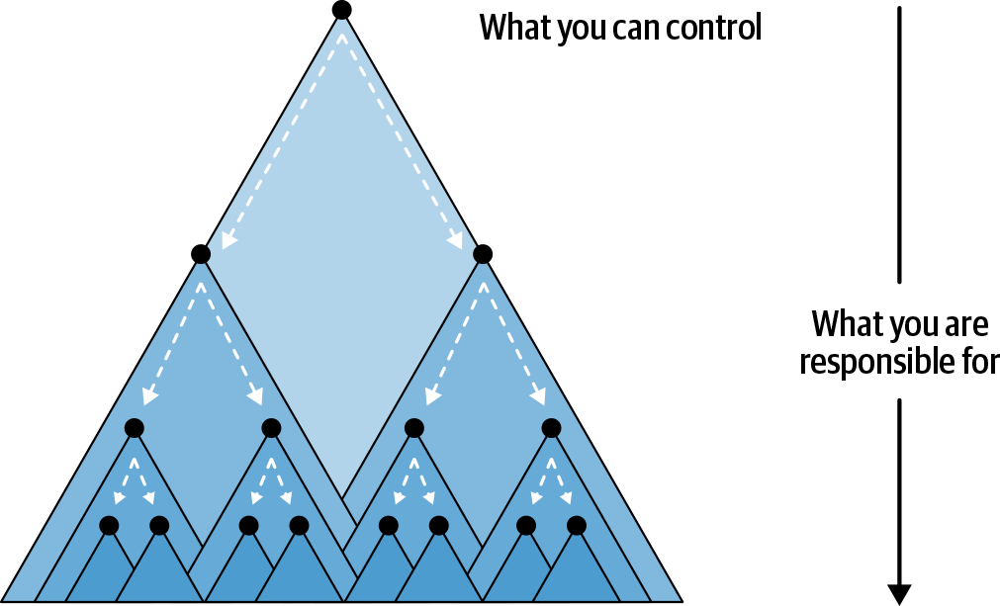
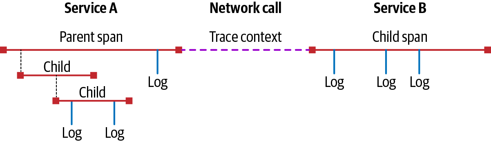

[← 序](00-foreword.md) · [目录](00-index.md) · [下一章：第 1 章 →](01-the-problem-with-distributed-tracing.md)

# 引言：什么是 Distributed Tracing？

如果你正在读这本书，你或许已经对 distributed tracing 这两个词有所耳闻。也可能完全不知所云。我们不评判，真的。不管怎样，你读这本书，是想弄明白 distributed tracing 到底是什么，以及如何用它来理解你的微服务和其他软件的运行表现。既然如此，我们先从一个简单的定义开始。

Distributed tracing（也叫 distributed request tracing）是一类关联式 logging，帮你获得对分布式软件系统运行状况的可见性，服务于性能剖析（profiling）、生产环境调试、故障或其他事故的根因分析等场景。它让你能准确理解某个具体服务作为整体的一部分在做什么，从而使你能提出并回答关于单个服务乃至整个分布式系统性能的问题。

就这么简单——下一本书再见！

什么？大家为什么都要退钱？哦……

我们被告知，你需要的可不止这么点。那好，我们退一步，聊聊软件——具体说，是分布式软件——好更清楚地理解 distributed tracing 要解决的问题。

## 分布式架构与你

在虚拟化与容器化取得进展之前，你若想部署某种基于 Web 的应用，就得有一台物理服务器，可能还得是专供你这个应用的。随着流量增长，你要么给那台服务器加物理资源（比如加内存），要么搞多台服务器，每台各跑一份你的应用。

对一个单体的 server process 而言，这种横向扩展（horizontal scaling）往往意味着成本、性能与组织开销上的糟糕取舍。多跑几个 server 实例，等于把服务器的全部功能都复制一遍，而不是独立地扩展各个子组件。在传统基础设施上，你常常被迫做一道选择题：为了让额外容量上线，能容忍多少分钟（甚至多少小时！）的性能下降？服务器不便宜，不需要时何必跑在峰值容量上？最后，随着应用规模与复杂度增长、参与开发的工程师越来越多，测试与验证新改动也变得更难。组织一大，开发者要弄懂一个代码库都已不现实，更别提整个系统的形状。改动越来越小，却越来越容易引发涟漪效应——影响从一个组件辐射到另一个组件，最终导致整个应用崩溃。

然而时间向前走，这些问题的解法也被造了出来。先是有软件把物理硬件的细节抽象掉，比如虚拟化，让一台物理服务器能切成多台逻辑服务器。Docker 及其他容器化技术延伸了这一思路，在更笨重的虚拟机之上提供一层轻量、好用的抽象，把「谁来部署这个软件」的问题从运维（operator）转移给了开发者。云计算的普及与「按需计算资源」的概念解决了资源扩展问题：如今点一下按钮，就能给某台服务器加内存或 CPU 核。最后，微服务架构的构想登场，用一组松耦合、相互独立的服务来组织大型应用，以应对越来越大、越来越复杂的软件业务所带来的复杂度。

今天，可以说大多数应用都以某种方式分布着，即便它们并没有用微服务。简单的 client-server 应用本身就是分布式的——想想那个经典问题：「我发往服务器的调用超时了；是响应丢了呢，还是活儿压根没干？」此外，它们还可能带各种分布式依赖，比如以服务形式从云厂商消费的 datastore，或是一大堆第三方 API——从分析到推送通知，无所不包。

## Deep Systems

分布式架构是软件架构师常说的 deep system 的最佳范例。这类系统之所以值得注意，不在于它们的宽度，而在于它们的复杂度。想想分布式架构里某些服务或某类服务，你就能看出区别。一个 cache node 池是往宽里扩的（意思是，加实例来扛需求），但另一些服务的扩展方式不同。请求可能穿过三层、四层、十四层、甚至四十层不同的服务，而每一层都可能有你并不知道的其他依赖。哪怕你负责的服务相对简单，你的软件大概也依赖着几十个别人写的代码、云厂商的托管服务、甚至管理其状态的底层编排软件。

Deep system 的问题最终是一个人的问题。要弄懂哪怕单次请求 critical path 上的那些服务、并持续维护它们，对一个人乃至一群人来说都很快变得不现实。作为服务 owner，你能控制的范围与你被隐含地要求负责的范围，见图 P-1。这种盘算就是压力与倦怠的配方：你被迫对别的服务 owner 采取被动姿态，成天救火，还要琢磨自己的服务和别人的服务究竟如何互动。

图 P-1　你能控制的服务，其依赖由你负责，你却没有直接控制权。

## 理解分布式架构之难

把软件分布开来，会带来新的、令人兴奋的挑战。失败与崩溃，突然间变得更难定位。你负责的服务，可能正从一个你无法控制的源头收到意料之外的数据，因为那个源头的服务由地球另一端的团队（或一个远程团队）管理着。你以为固若金汤的那些服务，一旦出问题，会突然在你所有服务里引发连锁的失败与错误。借 Twitter 的一个说法：你手上摊上了一桩「微服务谋杀案」（见图 P-2）。

图 P-2　它好笑，是因为它是真的。

把这个比喻继续下去：monitoring 能帮你确定尸体在哪儿，却无法揭示谋杀为何发生。Distributed tracing 用三大痛点的解法，补上了这些缺口，让你能轻松读懂整个系统：

**混淆（Obfuscation）**

应用越分布，失败的前后连贯性就越差。换句话说，因与果之间的距离拉大了。云厂商的 blob 存储出一次故障，可能扩散成所有人巨大的级联延迟；也可能某个在许多跳之外的服务出了一次极难诊断的故障，让你找不出近因。

**不一致（Inconsistency）**

分布式应用整体上或许可靠，但各个组件自身的状态，可能比单体或非分布式应用里的状态要不一致得多。何况，分布式应用的每个组件都被设计成高度独立，这些组件的状态必然不一致——比如，有人做了一次部署会发生什么？其他所有组件都清楚该怎么做吗？这又如何影响整个应用？

**去中心化（Decentralized）**

关于服务性能的关键数据，按定义就是分散的。某个服务可能正跑着上千个副本、散布在几百台主机上，这时你要如何查找它的故障？又该如何把这些故障关联起来？分布应用最大的长处，恰恰也是理解它究竟如何运作的最大障碍！

你或许正想：「这些难处，我们怎么解决？」剧透一下：distributed tracing。

## Distributed Tracing 如何帮得上忙？

Distributed tracing 是管理 deep system 带来的复杂度爆炸的关键工具。它提供贯穿一次请求生命周期的 context，可用来看清你的架构如何互动、长什么形状。不过，单条的 trace 只是开始——聚沙成塔之后，trace 能就你分布式系统里真正发生的事给出重要洞见：不仅让你能把关于服务的有趣数据关联起来（例如，大多数错误都发生在某台特定主机或某个特定数据库集群上），还让你能筛选并排列其他类型 telemetry 的重要性。实际上，distributed trace 提供的 context，帮你把问题排查收窄到只与本次调查相关的范围，让你不必在多个 log 与 dashboard 之间靠猜和试。如此，distributed tracing 其实处在现代 observability 平台的中心，成为你分布式架构的关键组件，而不是一个孤立的工具。

那么，什么是 trace？理解它最简单的办法，是把你的软件看成一次次请求。你的每个组件，都在响应来自另一个服务的请求（即 RPC，remote procedure call）而干着某种活。这活可能平淡如一个网页向某个服务端点索要结构化数据以呈现给用户，也可能复杂如一个高度并行的搜索过程。活本身的性质不太重要——尽管某些模式会更适合某些 tracing 风格，我们后文会讲。虽说 distributed tracing 在大多数分布式系统里都能用，但正如第 4 章将讨论的，它最擅长建模的是你各服务之间的 RPC 关系。

除了 RPC 关系，再想想这些服务各自干的活。也许它们在认证和授权用户角色，在做数学计算，或只是把数据从一种格式转成另一种。这些服务通过 RPC 相互通信，发请求、收响应。不管在干什么，所有服务有一个共同点：它们干的活都耗去一段时间。服务与 RPC 的基本模式见图 P-3。

图 P-3　一个从 client process 发往 service process 的请求。

我们把每个服务所干的活称为一个 span——就是这活所需要的「时间跨度」。span 可以用 metadata（称为 attribute 或 tag）与 event（也叫 log）来标注。服务之间的 RPC，则通过关系来表示，这些关系刻画请求的性质与发生的先后次序。这种关系靠 trace context 传播——trace context 是一点数据，唯一标识一条 trace 及其中的每个 span。每个服务产生的 span 数据随后被送往某个外部进程，在那里聚合成一条 trace、分析出更多洞见、并存储起来以备进一步分析。一个简单的 trace 例子见图 P-4：一条两个服务之间的 trace，以及第一个服务内部的一条 subtrace。

图 P-4　一个简单的 trace。

Distributed tracing 缓解分布式架构中的混乱：它确保穿过你各服务的每一次逻辑请求，都被呈现为一次独立的逻辑请求。它保证与某次业务逻辑执行相关的所有数据，在被分析、被呈现的那一刻仍然耦合在一起。它用「沿特定 API 或其他路径的服务间关系来查询」的方式，解决不一致问题，让你能问出「当那个服务挂了，我的 API 会怎样？」这类问题。最后，它解决去中心化问题：提供一种机制，让各个进程能各自独立地把 trace 数据交给一个 collector，由后者稍后集中起来，从而使你能看见并理解那些跨多个数据中心、区域或其他分布运行的请求。

## Distributed Tracing 与你

再说一遍，distributed tracing 是理解分布式软件的一种方法。可这话就像在说「水是湿的」——没多大用，而且过度简化。事实上，要理解 distributed tracing，最好的办法就是看它在实践中怎么用——这正是这本书的用武之地！

在接下来的章节里，我们会讲清你为应用实现 distributed tracing 所需知道的三件大事，并讨论可用于解决分布式架构所引发问题的各种策略。你会学到给你的软件做 distributed tracing instrumentation 的不同方式，以及可用的 tracing 与 monitoring 风格。我们会讨论如何收集 instrumentation 产出的全部数据，以及围绕 trace 数据采集与存储的各种性能考量与成本。之后，我们会讲如何从 trace 数据中创造价值，把它变成有用的运维洞见。最后，我们会聊聊 distributed tracing 的未来。

读完本书，你应当理解 distributed tracing 这个令人兴奋的世界，并知道为你的软件在何处、如何、何时实现它。归根结底，《Distributed Tracing in Practice》的目标，是让你更轻松地构建、运行和理解你的软件。我们希望书中的经验，能帮你所在的组织建设下一代 monitoring 与 observability 实践。

---

### 译者注

1. **「微服务谋杀案」（microservices murder mystery）**：借自 Twitter（现 X）上流传的说法，把分布式系统排障比作刑侦破案。

[← 序](00-foreword.md) · [目录](00-index.md) · [下一章：第 1 章 →](01-the-problem-with-distributed-tracing.md)
