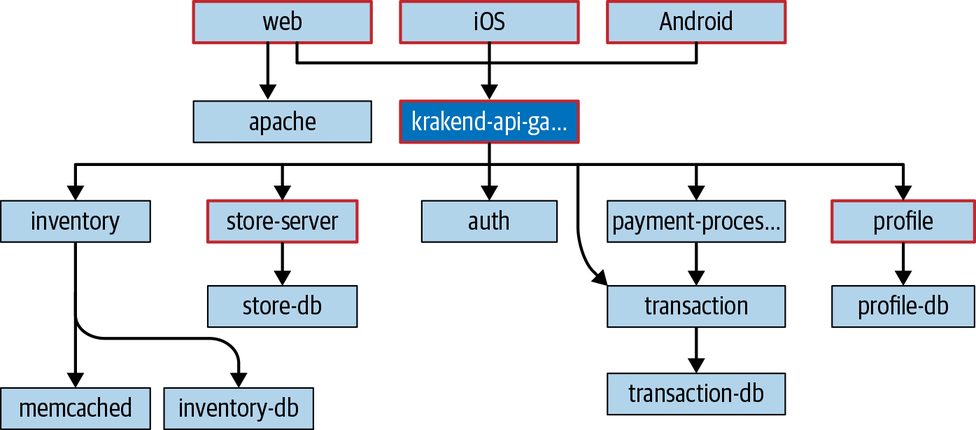
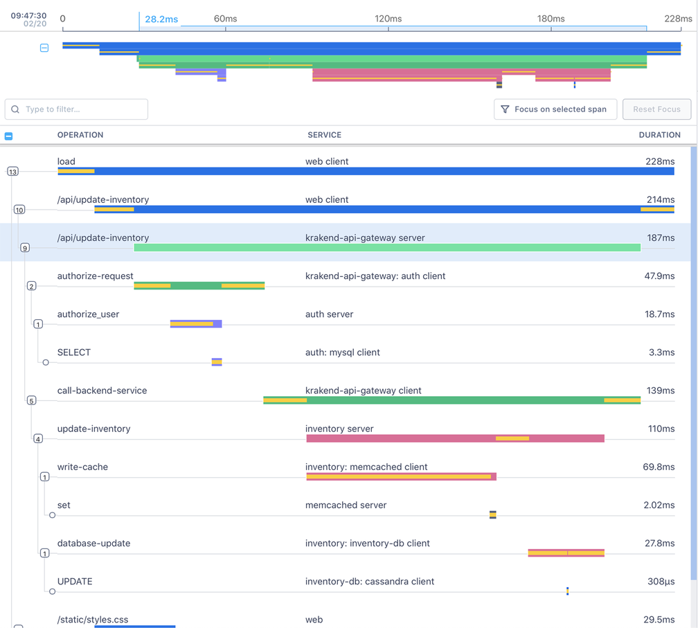

[← 引言](00-introduction.md) · [目录](00-index.md) · [下一章：第 2 章 →](02-an-ontology-of-instrumentation.md)

# 第 1 章　Distributed Tracing 的难题

> I HAVE NO TOOLS BECAUSE I'VE DESTROYED MY TOOLS WITH MY TOOLS.
> ——James Mickens

追踪一个计算机程序的执行，这件事本身一点也不新鲜。你或许会说，能看懂一个程序的 call stack，对各式各样的 profiling、debugging 与 monitoring 任务都相当关键。的确，stack trace 很可能是世界上使用量第二大的调试工具，仅次于满地撒在代码库里的 print 语句。然而，过去二十年里，我们的工具、流程与技术都进步了，因而要求新的方法论与思维方式。正如我们在引言里回顾的，微服务这类现代架构从根本上打破了这些经典的 profiling、debugging 与 monitoring 方法。Distributed tracing 正待纾解这些问题，补上我们那些被自己的工具砸出来的窟窿。

只有一个问题——distributed tracing 可能很难。为什么会这样？当你试着上手 distributed tracing 时，通常会撞上三个根本性难题。

首先，你得能生成 trace 数据。你的 runtime 或许对 distributed tracing 的一等公民支持时有时无，甚至完全没有。你的软件结构，或许不容易接纳发出 trace 数据所需的 instrumentation 代码。你用的模式，或许与多数 distributed tracing 平台基于请求（request-based）的风格背道而驰。常常，distributed tracing 计划还没起步就夭折，就栽在给既有代码库做 instrumentation 的挑战上。

另一个难题，是如何采集与存储软件生成的 trace 数据。设想成百上千个服务，每个都为每次请求发出小块 trace 数据，每秒可能数百万次。你要如何捕获这些数据、存起来以备分析与检索？如何决定留下什么、留多久？又如何在服务请求量上涨时，同步扩展数据采集能力？

最后，等你拿到这一切数据，又该如何真正从中榨出价值？如何把你收到的原始 trace 数据，转化为可据以行动的洞见与动作？如何用 trace 数据为其他服务 telemetry 提供 context，从而缩短诊断问题所需的时间？你能把 trace 数据变成对业务其他部门（而不只是工程师）也有价值的东西吗？这些问题乃至更多，让许多想上手 distributed tracing 的人裹足不前、一头雾水。

一次 distributed tracing 部署带来的成果，是一件让你能看清 deep system、并能轻松理解单次请求中各个服务如何共同影响该请求整体性能的工具。你生成的 trace 数据，不仅能用来绘制分布式系统的整体形状（见图1-1），还能用来看清单次请求内部各个服务的性能。

   
  图1-1：由 trace 数据生成的服务地图

如图1-2所示，你能沿着请求从前端客户端流入后端服务的路径审视它，理解延迟或错误是如何——以及为何——发生的，以及它们对整个请求造成了什么影响。这些 trace 提供的信息极为丰富，在你排查生产环境问题时弥足珍贵，比如能标明某个服务正跑在哪台主机或哪个区域（region）的 metadata。你可以按自己的心意搜索、排序、过滤、分组，乃至任意切分这些 trace 数据，以便快速排障，或弄清不同维度如何影响你的服务性能。

   
  图1-2：一条由前端 Web 客户端发起请求的样例 trace

那么，要如何从这里走到那里？要成功部署 distributed tracing，你需要什么？

## 一次 Distributed Tracing 部署的组成部件

为回答这些问题、帮你理清对这件事的思路，我们把 distributed tracing 部署拆成三大块重点，本书的结构也照此编排。这三块层层相叠，但通常在不同时刻对不同的人各有用处——你绝不必成为三块都精通的专家！每一部分里，你都会看到有用的解释、经验与示例，教你如何在自家组织里构建并交付一次 distributed tracing 部署，帮你对自己的系统与软件建立起信心。

**Instrumentation（插桩），见第 2 章**

Distributed tracing 需要 trace。Trace 数据可以通过给你的 service process 做 instrumentation 来生成，也可以通过把既有 telemetry 数据转换成 trace 数据来得到。在这一部分，你会了解 span——基于请求的 distributed trace 的积木块——以及你的服务如何生成它们。我们会讨论 instrumentation 框架的最新进展，比如 OpenTelemetry：一个被广泛支持的开源项目，提供 instrumentation API（以及更多东西），让你能轻松地把 distributed tracing 引导（bootstrap）进自己的软件。此外，我们还会讨论给遗留代码以及全新（greenfield）开发做 instrumentation 的最佳实践。

**Deployment（部署），见第 5 章**

一旦你开始生成 trace 数据，就得把它送到某处去。为组织部署 tracing，需要理解你的软件跑在哪里——既包括终端用户及其客户端，也包括服务器端——以及它是如何被运维的。你需要理解采集与存储 trace 数据在安全、隐私与合规上的影响。你可能会在开销上遇到取舍：留多少数据、又通过一个叫 sampling 的过程丢弃多少。我们会讨论围绕这些话题的最佳实践，帮你理清如何为你的系统快速部署 tracing 基础设施。

**Delivering value（交付价值），见第 7 章**

一旦你的服务开始生成 trace 数据、你也部署好了采集它所需的基础设施，真正的好戏就开场了！如何把 trace 与你的其他 observability 工具与技术（如 metrics 和 log）结合起来？如何度量真正要紧的东西——而「要紧」又该如何定义？Distributed tracing 提供了回答这些问题所需的工具，我们会在这一部分帮你把它想清楚。你会学到如何用 trace 改善你的 baseline performance，以及在系统着火时，tracing 如何帮你回到那条基线。

说了这么多，仍有一个悬而未决的问题：distributed tracing 与微服务、乃至更广义的分布式架构，究竟是什么关系？我们在「引言：什么是 Distributed Tracing？」里提过一点，但这里不妨岔开一下，把这几样东西之间的关系再捋一捋。

## Distributed Tracing、微服务、无服务器，我的天哪！

关于微服务，如今它们早已过了「每个分析师都在其『20XX 年十大趋势』清单里挂一笔」的热门期，于是有一种论调冒了出来——大意是：这场仗已经打完了。云计算的爆炸式流行、Kubernetes、容器化，以及其他能快速供给与部署硬件（或类硬件抽象）的开发工具，毫无疑问改变了整个行业。这些因素会让人产生一种错觉：问出「我该用微服务吗？」这个问题，就等于自曝是个傻瓜或江湖骗子。

这里先退一步，看看真实世界的数据。首先，有证据表明容器的实际生产使用率并不像炒作得那么高：只有 25% 的开发者在生产环境使用它们。相当多的工程组织，大量工作仍在使用传统的单体（monolith）。为什么？一个原因，说来讽刺，或许正是缺乏可用的 distributed tracing 工具。

开发者兼作家 Martin Fowler 为采纳微服务的人指出了三项主要考量：快速供给硬件的能力、快速部署软件的能力，以及一套能迅速发现严重问题的 monitoring 机制。我们钟爱微服务的那些特质（独立性、幂等性等等），恰恰也是让它们难以理解的特质，出了问题时尤其如此。Serverless 技术给这道算式又添了更多混乱：它让你对某个特定 function 的 runtime 环境看得更少，而且往往顽固地抗拒你惯用工具的 monitoring。

那么，面对这些问题，我们该如何看待 distributed tracing？首先，distributed tracing 解决了 Fowler 提出的 monitoring 问题：它让你看清微服务架构的运行状况。它让你能对请求链条中各个服务的性能与状态获得关键洞见，而换作别的方式，这既困难又费时。Distributed tracing 让你能准确理解某个具体服务作为整体的一部分在做什么，从而使你能提出并回答关于单个服务乃至整个分布式系统性能的问题。

单靠传统的 metrics 与 logging，根本比不了 distributed tracing 所提供的额外 context。比方说，metrics 能让你对某个服务的所有实例正在发生什么有个聚合认识，甚至能把查询收窄到特定的一组服务，却应付不了无穷基数（cardinality）[^1]。

Log 呢，能提供某个服务极其细粒度的细节，却没有内建的办法把这份细节放到「一次请求」的 context 里。你固然可以用 metrics 和 log 去发现并处理分布式系统里的问题，但 distributed tracing 提供的 context，能帮你在事故正发生的当下（每一秒都金贵）把定位根因所需的搜索空间收窄。

正如我们在引言里提到的，试图管理与理解一个复杂、基于微服务的分布式架构，会带来压力与倦怠。如果你正在考虑迁往微服务、正处在从单体到微服务的迁移途中，或早已被委以驯服一座庞大微服务架构的重任，那么在琢磨如何理解自家软件的健康与性能时，你或许也正体会着这份压力。Distributed tracing 或许不是万灵药，但作为更大 observability 策略的一部分，它可以成为你运维可靠分布式系统的关键一环。

## Tracing 的收益

Distributed tracing 具体能带来哪些收益？我们会在本书余下篇幅里细谈，但先来盘一盘显而易见的「好处」：

- Distributed tracing 能改变你开发与交付软件的方式，这点毋庸置疑。它不仅有益于软件质量，也有益于组织的健康。
- Distributed tracing 能提升开发者生产力与开发产出。它是开发者理解生产环境分布式系统行为最好、最省力的办法。用 distributed tracing，你在排障与调试分布式系统上花的时间会比不用时更少，还会发现一些你原本根本不知道存在的问题。
- Distributed tracing 支持现代的多语言（polyglot）开发。由于 distributed tracing 与你的编程语言、monitoring 厂商、runtime 环境都无关，你可以把同一条 trace 从 iOS 原生客户端，经 C++ 高性能代理，穿过 Java 或 C# 后端，一路传到 web-scale 数据库再传回来，全部在一个地方、用一件工具可视化出来。没有哪套工具能给你这样的自由与弹性。
- Distributed tracing 通过让你快速看清变更，减少部署与回滚所需的开销。这不仅缩短事故的平均解决时间（MTTR），也缩短新功能的上线时间与性能劣化的平均发现时间。它还改善了团队间的沟通与协作，因为你的开发者不再被隔离在各自那一小块饼的某套 monitoring 里——从做前端的到钻数据库的，人人都能看同一份数据，理解变更如何影响整个系统。

## 摆好桌子

说了这么多，希望我们已经抓住了你的注意力！我们来回顾一下：

- Distributed tracing 是一件工具，让你借助 trace——表示请求流经系统之过程的数据——来给分布式系统做 profiling 与 monitoring。
- Distributed tracing 与你的编程语言、runtime 或部署环境无关，几乎可用于任何类型的应用或服务。
- Distributed tracing 改善团队协作与配合，并缩短发现与解决应用性能问题的时间。

要兑现这些收益，首先你得有一些 trace 数据；然后你得采集它；最后你得分析它。那我们就从头开始，聊聊如何为 distributed tracing 给代码做 instrumentation。

[^1]: Cardinality 是数学术语，指一个集合或分组中元素的个数。放到 metrics 的语境里，它指的是「metric 名称」与「挂在该名称上的键值 attribute」的**唯一组合数**。我们会在后续章节更详细地讨论。

---

### 译者注

1. **章节题词**：James Mickens 是哈佛大学计算机科学教授，以犀利幽默的技术演讲与随笔著称；这句「I have no tools because I've destroyed my tools with my tools」出自其 2013 年的文章，常被引用来讽刺现代系统的复杂度。
2. **小节标题「Distributed Tracing、微服务、无服务器，我的天哪！」**：原文 "Distributed Tracing, Microservices, Serverless, Oh My!" 化用经典电影《绿野仙踪》里 Dorothy 的台词 "Lions and Tigers and Bears, Oh My!"。

[← 引言](00-introduction.md) · [目录](00-index.md) · [下一章：第 2 章 →](02-an-ontology-of-instrumentation.md)
