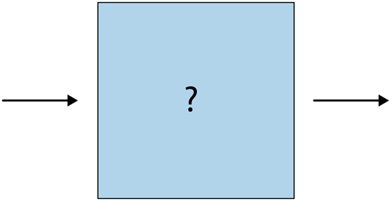
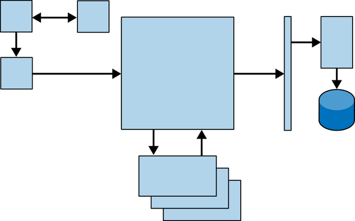
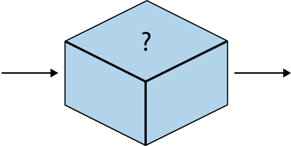
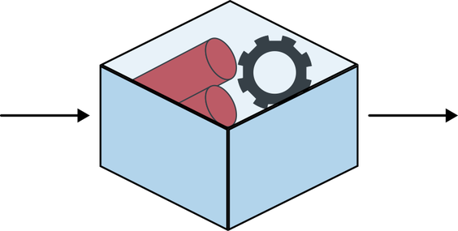
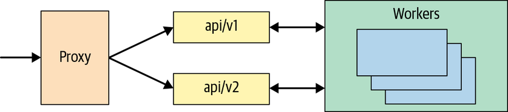
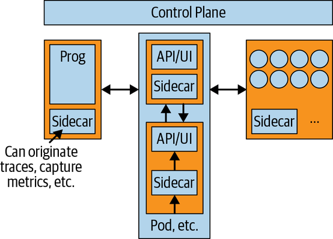
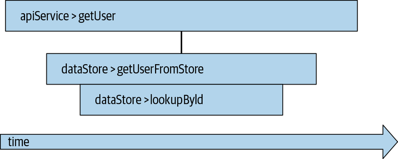
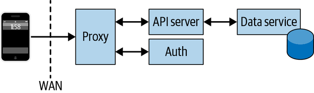
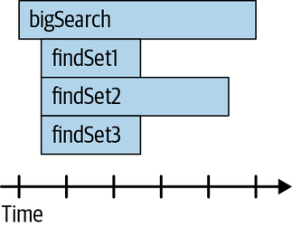
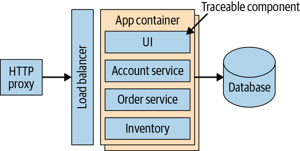

<div align="center">

[← 第 1 章](01-the-problem-with-distributed-tracing.md) · [目录](00-index.md) · [下一章：第 3 章 →](03-open-source-instrumentation-interfaces-libraries-and-frameworks.md)

</div>

# 第 2 章　插桩的本体论（An Ontology of Instrumentation）

当你画一张系统图时，会从什么开始？我们常常先画一个方框，代表单个服务，如图2-1。

<p align="center">
  <br>
  图2-1：服务、组件、函数，或随你怎么称呼的一个可视化表示
</p>

这个方框会被延伸、被添加，并通过虚线与实线、箭头，以及其他逻辑相连的织物，连到形形色色的其他方框上。说到底，我们终究逃不开「软件就是平面上这一串相连的方框」这个念头。而很多时候，我们除了把方框想象成一个「接收输入、做点什么、再把输出送到远处另一个方框」的简单函数之外，也想不出别的（见图2-2）。

<p align="center">
  <br>
  图2-2：多个服务、组件、函数等以可视化方式连在一起
</p>

开发过程中，我们早就用各种方式给这些方框做过 instrumentation，好弄清每个方框里发生了什么——毕竟，几乎没有软件是没有 bug 的，任何接受用户输入的系统，多半都会收到开发者没料到的东西。你可以把 instrumentation 理解为任何帮助你 monitoring 或度量某个应用性能与状态的东西——于是你会写些 log，在用户给函数传入非法参数、或某个操作不被允许时记录下来。

> **Note**
> 正如引言所说，span 是一个服务所执行的一个工作单元。我们会在第 3 章讨论它们更具体的表示形式，但在接下来几节里，我们先用 JSON blob 来表示它们。

现在，既然你在读这本书，我们姑且假定你对「为 tracing 而给代码做 instrumentation」感兴趣——这件事有它自己的一套考量与边界情况。本章我们会讲清你开始给一个应用做 instrumentation 前必须理解的两件关键事情，并讨论它们之间的取舍。最后，我们会演示如何应用所讲的 instrumentation 手法，去 trace 一个通过 HTTP 通信的简单服务。

## 白盒 vs 黑盒

第一个大话题，是白盒（white box）与黑盒（black box）instrumentation 之别。还记得图2-1里那个装着我们想 monitoring 的服务的方块吗？把它侧过来，想象它是一个盒子——就像图2-3那样。

<p align="center">
  <br>
  图2-3：图2-1中那个服务的三维可视化表示
</p>

对一个外部观察者（比如我们服务的用户或消费者）来说，这个盒子完全不透明。你或许能得到某些保证，比如「我往这个盒子里放点东西，就会从里面拿到点别的」，但这个操作的实际机制，对身为用户的你来说不可知、也无从得知。设想一个场景：你是个外部终端用户，想知道盒子内部机制的运行表现——你所能做的，只有度量「把东西放进去」到「拿到结果」之间花去的时间。你没有任何真本事去建模盒子里发生了什么——除了纯粹猜测，而猜测在这种情形下并不管用——因此你能合理推断出的数据量相当小。我们把这类 instrumentation 视为针对黑盒运作。

把这个比喻套到一个跑在系统上的 daemon process，以及我们能度量它的各个维度上。作为这个进程的运维者，我可以查看 `/proc/<pid>/status` 来了解该进程有趣、甚至可能有价值的数据——例如映射到该进程的内存大小（VmSize）[^1]。我可以查看打开的文件句柄，用些花哨的算术算出该进程在固定时间窗口内的 CPU 使用率，诸如此类。然而，这些几乎都帮不上我 trace 这个应用。要 trace，我需要观测我这个进程那一组可观测的输入：

- I/O 设备
- 系统调用（system call）
- 网络活动
- 外部库
- 进程操作

在分布式系统的语境里，其中好几样可以撇开；事实上，我们通常可以只盯住一样——网络活动。总的来说，跨多台物理或虚拟服务器运行的分布式应用，其大部分输入都由一条经由 LAN 或 WAN 链路送达的 RPC（remote procedure call）定义。这并不贬低其他输入形式的价值或重要性（它们对调试或深度的内核级 tracing 可能至关重要），但确实有助于我们聚焦讨论。

于是，黑盒 trace 的一个例子，就是通过某种代理（proxy）观测某个进程进出的网络流量。如果我们知道这个黑盒接受形如 `/api/:operation/:resourceId` 的请求、并以某种消息回应，就能用这个代理造出一个 span，形如例 2-1。

**例 2-1　黑盒 trace**

```text
{
    'operationName': '/api/<operation>',
    'duration': <endTime—startTime>
    'tags': [
        {'resource': '<id>'},
        {'service': '<processName>'},
        {'wasSuccess': true}
        // And so forth—pid, other metrics
    ]
}
```

通过分析进出该进程的流量，我们能收集到构建一个有用 span 所需的数据。

讲到这里，我们一直在谈黑盒 instrumentation，前提是我们不知道盒子内部发生了什么。如果我们把它打开、往里面看（如图2-4），会怎样？因为我们都了解自己所写服务的内部构造——毕竟是我们自己写的——我们就能轻松提出并验证假设。正是这份对服务的了解、以及修改它的能力，构成了白盒 instrumentation。

<p align="center">
  <br>
  图2-4：打开盒子后，你能看到所有输入、输出，以及它们如何被变换
</p>

有了「看向服务内部并修改其代码」的能力，我们就能以强大得多的方式给软件做 instrumentation。能充分理解服务的内部运作、它所操作的数据模型、以及构成其执行流的精确 call graph，就允许我们写出比别的方式更全面、更有用的 trace instrumentation。回想前面的例子——当仅限于观测输入输出时，我们的 span 可能缺少关键信息，比如我们的服务所发起的外部 RPC 调用之间的关系，或对分布式应用其他组件（如数据库）的请求。有了白盒 instrumentation，我们不必把整笔内部事务当作一个单一的逻辑整体，而几乎可以把它看作更大事务的一条 subtrace。

既然如此，你可能会想：「那我为什么不总是用白盒 instrumentation？」很简单：有时候你没法用。这在遗留软件更多、规模更大的工程团队里很常见——设想一个由遗留大型机应用支撑的现代 API 前端。即便你能修改遗留服务的源代码（这并不总是可能），你会愿意改吗？在这些情形下，你也许只能通过黑盒 instrumentation 来表示遗留组件里所执行的工作。记住，你并不一定要从运行该服务的系统来创建黑盒 span；一个典型模式是：让调用方服务用它的白盒 instrumentation，为那个黑盒进程另建一个 span。

## 应用 vs 系统

第二个话题，是应用（application）instrumentation 与系统（system）instrumentation 之别。关于应用 monitoring 与系统 monitoring 的差异已有大量论述，而 distributed tracing 的 instrumentation 也遵循类似的脉络。我们简要回顾这一区分，并讨论它如何适用于 distributed tracing 的 instrumentation。

传统上，运维应用的人与运维那些应用所跑的服务器的人，关注点不同。系统运维者可能关心磁盘驱动器的健康、服务器可用内存的多寡，或其他系统 metrics。而应用运维者的问题更平实——应用有没有在响应请求？它的表现可接受吗？于是，应用运维者可能用脚本每隔几秒通过网络访问一次应用、报告任何失败，以此 monitoring 自己的应用。系统运维者则用类似的脚本查询服务器的操作系统，弄清磁盘何时快满了。

在 distributed tracing 的语境里，我们通常不太关心这类 metrics（更准确地说，我们通过其他来源收集它们），但也不该忽视。事实上，我们可以把它看成一个「由哪个组件生成 trace」的问题。简而言之：span 是在我们的应用代码里生成的，还是由某个运行我们应用代码的服务或子系统替我们生成的？

回到上一节那个简单服务——我们知道它有一些输入、产生一些输出。我们在服务图里再加几个方框，如图2-5。

<p align="center">
  <br>
  图2-5：API server、service proxy 与 worker process 的简单系统图
</p>

这些服务都可以各自独立地做 trace instrumentation，在单次请求依次穿过它们时各自发出 span——事实上，这是非常常见的模式，也是上手 trace 分布式系统最省力的方式。然而，应用往往对自身直接上下文之外发生的事情一无所知——一个无状态服务，甚至会对特定请求上下文之外的一切一无所知！这种情况下，我们需要往后退一点，不仅看正在运行的服务，还要看它们所栖身的底座（substrate）。这正是系统 instrumentation 登场之处。

系统可以是许多激动人心的东西——比如 Kubernetes 这类容器编排系统，或 DC/OS 这类托管平台。我们可以用这些系统以 span 或 context baggage 的形式生成 trace 数据，为应用提供开箱即用的 instrumentation，或提升应用代码所发出 span 的质量。由于这些编排器与平台实际上充当了其上所跑服务的操作系统（见图2-6），你就能提取出有用的系统数据，比如内存占用、CPU 份额利用率，以及其他位于进程或其容器之外的数据，并与应用共享，或作为单独的 span 发出去供分析。

<p align="center">
  <br>
  图2-6：图2-5中的服务，但跑在一个暴露系统数据的平台里
</p>

那么，什么时候该用应用 instrumentation，什么时候该用系统 instrumentation？理想情况下，两者都用。截至本书写作时，纯应用 instrumentation 通常更容易上手，但 service mesh 这类新技术，把实现系统 instrumentation 的难度大幅降低了。未来，我们预计像 Google Kubernetes Engine 或 AWS Fargate 这样的托管编排平台，会为跑在其上的服务提供无缝的 span context propagation。

## Agent vs Library

第三个话题，是基于 agent 的 instrumentation 与基于 library 的 instrumentation 之别。什么是 agent、什么是 library？记住，白盒的前提是：写 instrumentation 的人能拿到被插桩应用的源代码，并利用这份知识生成逻辑上更准确的 instrumentation。这与「用 library 做 instrumentation」的概念高度对应。反过来，黑盒假定你不具备应用源码的内部知识——agent 更接近这种情况，因为它们在进程本身之外运作。

Agent 与 library 这两个词在现代 tracing 圈子里用得很多，有时还被互换使用，结果令人困惑。有些 library 自称 agent，有些 agent 自称 library，中间还有一大堆说不清的东西。我们认为两者最大的区别归根结底在于**意图**。Library 的意图，是让你更容易写出可跨多个服务共享的 instrumentation，减轻在多语言分布式系统里创建 distributed trace 的采纳痛苦。Agent 则相反，意图是让你无需改写代码，就能极其轻松地 trace 并观测既有系统。

基于 library 的 instrumentation 手法，其特征是依赖一个应用级的、贯穿各服务使用的共享标准化 library。这些 library 提供合理且标准化的 API，用来处理创建 instrumentation 与传播 context 的关键部件。Library 可以支持一个多语言异构应用：它定义一套相对小巧的 API，只支持所有目标语言所共有的最小功能集。事实上，采用基于 library 的策略时，通常可以针对一个薄薄的 interface wrapper 写你的 instrumentation，而在运行时通过依赖注入（dependency injection）只依赖 library 的具体实现。话虽如此，基于 library 的 instrumentation 一般仍依赖开发者亲手写 instrumentation 代码。

基于 agent 的 instrumentation，依赖某种外部进程在运行时为进程做插桩。agent 的种类与策略很多，但 agent 直接给服务做插桩的方法实际上主要有两种。第一种，是某个外部进程或 monitoring 服务把代码注入你的服务，并借此在各个函数被调用时创建该服务的 trace。第二种，是某种进程内 agent 被引入某个进程的 runtime 环境，用一套用户自定义规则来 trace 特定动作。特别值得一提的是**间接**使用 agent 来捕获可转化为 trace 数据的数据——一个有趣的用法是扩展黑盒思路，拿某个既有的服务状态数据源（比如结构化或非结构化的 log 文件），由 agent 把它转换成 trace 数据。

真的，正如本章其他一切，你终归要把这些手法混着用。即便是现代代码，如果你从一开始就没考虑过如何给服务做 instrumentation，那么给现有服务与应用加上 tracing library 也会有实现成本。有些较老的服务甚至根本加不上 tracing，只能靠 agent 来插桩。话虽如此，即便你的软件与服务相当新，你也可以用 agent 来快速起步 tracing，以便更快证明价值，或为那些没有高质量 library instrumentation 的团队撑起整体系统可见性。

## Context 的传播

到目前为止，我们讨论了给服务做 instrumentation 以发出描述其工作之 span 的各种策略。这些 span 作为独立的数据，并不怎么激动人心。要创建 trace，我们需要某种办法，把 span 的某些细节传递给其他服务或进程的其他部分。我们把这些细节传递给其他服务的机制，一般称作 context propagation。

我们先聊传播的是什么，再聊怎么传播。假定我们有个简单的服务代理，提供围绕用户管理的若干功能。一个 span 会长什么样？（这些 span 的表示形式，我们会在第 3 章讲 OpenTelemetry 时更详细地展开。）

例 2-2 里的 span 有一些相当基础的信息——我们关心的操作、一个 tag——但也有了点新东西。我们加了一个 `spanId` 字段，为此 span 提供标识。概念上，我们的每个服务都会为它所做的工作发出一个 span，如图2-7所示。

**例 2-2　基本 span**

```text
{
    operationName: "api/getUser",
    spanId: "09f42f7e-e606-4923-831b-7dd612683720",
    tags: [
        {
            key: "userName",
            value: "testUser"
        },
    ],
    // Start time, duration, etc.
}
```

<p align="center">
  <br>
  图2-7：API proxy 与 datastore 服务之间的关系
</p>

我们的 datastore 服务里在发生什么？来看例 2-3。

**例 2-3　datastore 服务**

```text
{
    operationName: "getUserFromStore",
    spanId: "dac303fb-6c1c-4816-ac86-ce717cee1714",
    tags: [
        {
            key: "userId",
            value: 105832
        }
    ],
    // Start time, duration, etc.
}
```

Distributed tracing 的好处之一，是你的 span 大体上相互独立。正如我们后面章节会讲的，你可以从多个来源收集并集中数据，所以我们希望每个 span 都能知道彼此之间的关系，又不至于要到处传太多数据。对这种分布式 RPC，一种流行的做法是在 HTTP header 里于服务之间传递 trace context，让子服务创建一个定义了父子关系的 span。作为对比，第二个 span 的数据结构会形如例 2-4。

**例 2-4　定义了父子关系的 span**

```text
{
    operationName: "getUserFromStore",
    spanId: "dac303fb-6c1c-4816-ac86-ce717cee1714",
    parentSpanId: "09f42f7e-e606-4923-831b-7dd612683720",
    tags: [
        {
            key: "userId",
            value: 105832
        }
    ],
    // Start time, duration, etc.
}
```

> **Note**
> Trace context（有时简称为 context）会在第 3 章及本章后文展开。眼下，把它理解为一组全局唯一标识符——标识一条 trace 及其每个 span。通常，这些标识符是一堆随机比特或一个大随机数。

以上是基础——我们再深入一点，细看两种不同的传播：进程间与进程内。

### 进程间传播

微服务架构的一个关键观念是：我们可以把每个服务看作与其同伴相当独立。一个服务应当可靠、稳健地做一件逻辑上的事。这让我们能按需或其他信号横向扩展服务。这个观念与基于 span 的 distributed tracing 高度对应——每个服务，逻辑上都应有一个 span，对应该服务所执行的工作。把构成你微服务的那些 RPC 想成一种 call stack，往往很有帮助。想象一个由几个组件构成的应用，在我们前面所讲的基础上，如图2-8。

<p align="center">
  <br>
  图2-8：从 client 到 datastore 的服务图
</p>

现在，我们手动 trace 一个请求穿过这个系统，从客户端开始：

- client
- api-proxy
- auth
- api-server
- datastore

你做的任何一笔事务，逻辑上都要沿这样一串 RPC 走：client 跟 api-proxy 讲话，api-proxy 认证该请求并把它传给 api-server，api-server 跟 datastore 讲话，datastore 再把结果一路返回给 client。这些服务各自执行的工作，都是一个单一的、逻辑上的 span。我们能直觉地知道，需要某种机制把 trace context 沿这条请求链传播下去，好让每一次后续调用都能用这份信息与前驱建立父子关系。

就本节而言，我们假定服务之间用 HTTP 通信。不过，我们讨论的原则并不限于基于 HTTP 的进程间通信——它们也可以跑在 gRPC、Apache Thrift、SOAP 等多种传输方式之上。

#### 为什么用 HTTP？

在这里以及全书，讨论 RPC 时我们倾向于用 HTTP 与 RESTful API 的说法。这主要是因为 HTTP 相对简单、多数读者对它熟悉，以及一个事实：以 HTTP 作为消息传递系统、RESTful API 作为模型的这套东西，概念上很容易被 distributed trace 建模。

说到底，当你在其中任意两个服务之间发起 RPC 时，需要发生两件事。调用方需要一种办法，拿到当前的 span context，并把传播 trace context 所需的信息序列化到下一跳。被调方需要一种办法，发现 span context（如果存在），并用这份数据创建一个子 span。第一个动作，即序列化当前 span context，也叫 **inject**（注入）；后者叫 **extract**（提取）。我们是在把 span context「注入」传输层，再把它「提取」回来。这些 inject 与 extract 操作发生在我们服务的代码边界上——你一般会想在 HTTP 服务里用某种 middleware，在新请求被创建或收到时自动执行这些操作。

> **Note**
> Trace context 与 span context 这两个词在书中互换使用。一般来说，它们指同一份 context——关于一条 trace 与一个 span 的唯一标识符。

大致说来，inject 与 extract 的语义相当通用——你要么传入一个 span context，要么拿回一个。Span context 足够简单——它是一个包含某 span 标识符的对象。Span context 的确切实现因实现而异，但像 OpenTracing 这样的开源项目，把 span context 定义为一个对象，包含一个 SpanID、一个 TraceID，以及一个 baggage 数组（内含任意键值对）。总的来说，我们希望这些标识符相当唯一——span ID 应在某个 TraceID 内唯一，TraceID 则应在一个非常大的空间里唯一。多大？这完全取决于你的系统生成的 trace 数量，但一个随机 64 位值通常够用。W3C 即将出台的 trace context 通用规范，正围绕 128 位标识符（如 UUIDv4）做标准化，它把碰撞概率压得极低（要让 UUIDv4 出现单次碰撞的概率达到 50%，你得生成 2.71 × 10^18 个标识符——也就是每秒十亿个、连发 85 年！），对任何单一系统都应足够。

除了 ID，还有前面提到的 baggage——这是把信息从较早的服务传播到较晚服务的一种便利方式。设想你想把某条信息（比如用户 ID、版本号等）从 client 传播到每一个 span 里。你可以用 baggage 做到，但要小心！你放进 baggage 的任何东西，都会存在于你添加它之后的每一跳上，把这份额外数据推过网络所产生的开销，可能带来肉眼可见的性能损耗。

我们该如何使用这些方法？最好让它们以相当「无接触」的方式发生。一个好做法是：在 HTTP 请求流水线里放一个 middleware，尝试从每个进来的请求里 extract span context，并把它加到 request 对象上。然后，在你的 route handler 里，你就能查找传入的 span context 并创建一个新的子 span。类似地，用函数包裹你发出的 HTTP 请求，让它查找现有 span 并 inject 到发出的请求里，就能确保下游下一个服务（若 instrumentation 得当）能接住它。事实上，给既有应用做 instrumentation，一个高产的起步方式正是这套策略——我们后面会多谈。

非常重要的是，你的团队或组织要为传播 context 的格式定下标准。最终，W3C 的标准化努力会减轻这份负担，但截至本书写作，你还得确保上下游服务 owner 都同意你 span context 的格式。围绕一套共享代码来执行 inject/extract 做标准化效果很好，在同质环境里也容易做。在更多语言（polyglot）的世界里——比如你的微服务用各种语言编写与运行——务必让文档清晰、广泛共享，说明将承载你 trace context 的具体 header 以及数据的格式。开源 telemetry 框架也能减轻应对这个问题的负担，我们会在第 3 章讲。

### 进程内传播

进程间传播关心的是在不同服务之间传递 trace context；进程内传播关心的，则是在单个进程内部传递 trace context。我们为什么要这么做？如果我们都在盼望的那样，把微服务应用设计好，那每个服务不就只有一个 span 了吗？

并非所有应用都是微服务的漂亮排布。我们敢说，大多数应用都不是。我们见到越来越多所谓「士绅化」（gentrified）的应用——全新的 greenfield 开发，嫁接到庞大的 brownfield 单体之上。这类混合应用往往在核心单体周围涉及大量微服务——而你也知道，我们既想 trace 那些微服务，也想 trace 它们在单体内部发起的调用。即便在微服务里，我们也极可能想 trace 单个函数，或进入我们数据库的请求。

此外，并非所有微服务都一样「微」——想想一个在多个线程或跨多个远程服务上并行处理工作的 worker 服务。在所有这些情况下，能在一个服务内部传播 trace，从而创建更准确代表所执行工作的 span，都会大有益处。

这里的基本概念与「进程间传播」一节所讲的非常相似，只有一个关键差别。由于我们不是在发起 RPC，就不必操心 inject 或 extract 我们的 span context，也不必跨进程边界序列化或反序列化它。总的来说，我们更关心 span 的作用域（scope）。其细节相当依赖具体语言，但我们给出概念概述。在多线程或异步处理的场景里，我们可以把一个 **active span** 定义为：在任一时点，处于我们进程所做工作作用域内的那个 span。看例 2-5 的伪代码。

**例 2-5　active span**

```text
async function bigSearch(*context, key, dataset...) {
    for dataset d {
        let result = await d.findInSet(*context, key)
    }
    return result
}
async function (dataset) findInSet(*context, key) {
    while *context.isNotCancelled {
        let found = d.find(key)
        if found {
            *context = *context.Cancel
            return found
        }
    }
}
```

我们的 `bigSearch` 函数可以接收任意数量的 dataset、一个 context，以及一个要在这些集合里查找的 key。对每个集合，它起一个线程并开始查找 key。找到 key 时，它取消 context、返回结果，从而让其他所有查找也一并短路。我们可以用图2-9所示的时序图来可视化——它正是由例 2-6 的伪代码生成的。

<p align="center">
  <br>
  图2-9：展示子 span 提前取消的 span 时序图
</p>

你如何在 span 里创建这些关系？如前所述，我们可以用 span context 在 span 之间建立父子关系，同样的原则在此适用。由于不必跨 RPC 边界，最简单的办法就是把 span context 作为参数传给子函数，如例 2-6。

**例 2-6　把 span context 作为参数传给子函数**

```text
async function bigSearch(*context, key, dataset...) {
    let span = startSpan("bigSearch")
    span.setTag("searchKey", key)
    for dataset d {
        let result = await d.findInSet(*context, key, span.context)
    }
    span.finish()
    return result
}
async function (dataset) findInSet(*context, key, spanContext) {
    let childSpan = startSpanFromContext("findInSet", spanContext)
    while *context.isNotCancelled {
        let found = d.find(key)
        if found {
            *context = *context.Cancel
            span.log("found span in dataset", d)
            span.finish()
            return found
        }
    }
    span.setTag("cancelled", true)
    span.finish()
}
```

> **Note**
> 上面这段伪代码，用的是 Go 或其他提供「用户托管的进程 context 对象」的语言风格。在 Java 或 C# 这类语言里，thread-local storage 会提供类似的功能。要点是：你要把 span context 传进那些你想为其创建 span 的子函数，并用你所处语言提供的任何设施来做。它可以简单到只用一个函数参数把单个 span 对象传下去。

这种情况下，每个子 span 都只有一个父 span，但为了到处接收 span context 而修改方法签名，实在有点丑。别担心，有一种更省力的办法，叫 **scope manager**，但它取决于你所用的具体技术与语言。总的来说，scope manager 用 thread-local storage 自动保存对某函数 active span 的引用，省去了手动环节，并能用该引用来从 active span 创建新的子 span。我们会在第 3 章讨论 scope manager 的具体实现。眼下你只需知道：你的 trace 不必只限于 RPC！

## Distributed Tracing 的形态

现在我们已经介绍了给服务做 instrumentation 的一些基本概念，接下来深入一点，让它更贴近现实。你或许已理解不同形式的 instrumentation 以及它们如何相互作用，但这些概念怎么与我们熟悉的软件与服务挂上钩？总的来说，distributed trace 与常见软件架构风格之间，存在某种固定的模式——或者叫**形态**。我们来回顾这些形态，并就哪种 instrumentation 手法最合适给些指点。

### 对 Tracing 友好的微服务与 Serverless

Distributed tracing 与微服务/serverless，字面意义上就是天生一对。历史上，distributed tracing 技术由拥有成千上万乃至数万个微服务、由成百上千人运维的大型工程组织打造。那么，当涉及能否被 trace 时，并非所有微服务生而平等，这或许会让你吃惊。事实上，基于 span 的分布式请求 tracing 有几项特征，你可以照着做，从而从你的微服务或 serverless 架构里得到更有用的 trace。这里讲讲几条要点（do 与 don't）。

**一般来说，用微服务或 serverless 时，先考虑白盒 instrumentation**

你的微服务应当足够小，小到你能做出必要的改动、以采用基于 library 的 instrumentation 实践——也就是把 tracing 代码集成进服务本身。这不仅让 trace 数据更准确地贴合服务的实际功能，也给你机会：随着服务被更新以利用 tracing，逐步把 tracing 建起来。把你每个服务的语义信息捕获进 trace 数据。一个 tracing 得好的微服务，应当给它生成的 span 附上相关的语义 attribute（比如 OpenTelemetry 的 `span.kind` attribute）。这让你对服务在做什么有个更完整、更准确的视图，在微服务架构里尤其有益，因为你对「trace 数据的消费者是否了解你的服务在做什么」的把握更少。

**为要紧的东西创建 attribute！**

想想如果你要在凌晨三点排查一场生产事故，你会想知道什么，然后把它们加上去。推荐的一些 attribute/tag 是 `hostname`、`region` 或 `datacenter`、以及 `service.version`。一个越来越常见的好主意是加一个 `README` attribute，或其他指向某个内部系统的指针，标明人们可以去哪里提问或了解该服务的更多信息。确保 ingress 与 egress 都被 trace[^2]。正如我们提到的，最佳实践是让「为进出请求创建 span」这件事由你的 RPC library 自动处理。

**最后，从你已知的地方开始**

如果你有特定的麻烦点、对延迟敏感的服务，或其他感兴趣的区域，那么做出有用 trace 最快的办法，就是从那里开始建。通常，加一点 instrumentation 去理解你眼下遇到的问题，会比等一份大规模 instrumentation 计划制定并执行更容易——我们后面会更详细地讲。

也有一些事情要避免：

**别忽略定下「路上的规矩」**

成功 instrumentation 最关键的一点，是每个服务都能创建出属于更大 distributed trace 的 span。这意味着你最先要做的事情之一，是确保使用了标准的 context propagation header 与格式。第 4 章会深入讲各种开源 distributed tracing 框架；我们建议用其中一个。

**一般来说，别试图 trace 执行时间极长的操作**

分布式请求 tracing 最擅长的是：整笔被 trace 的操作发生在一个相当短（几分钟）的时间跨度内。原因有几个，比如 trace 分析器的数据保留期与 sampling 考量（我们后面会讲），但眼下只需说：这不是个好的适配。如果你要 trace 执行时间极长的操作，别发愁，有办法应对那些用例。

**如果你拥有一个不在 critical path 上的服务，别以为你什么都不用做**

你可能觉得自己的服务不重要，或在一条 trace 里没什么角色。至少，你要确保你所有的服务都把可能从调用方传来、要传给被调方的 tracing header 透传过去。不过我们建议：既然你都要做这一步了，把微服务包进一个 span 再发出去，也花不了多少额外功夫，还能让所有人对应用所做的工作有个更完整的视图。

**最后，别在本地留存 trace 数据太久**

这在 serverless 服务里更值得留意，但总体也是好建议——最好是定期把 trace 数据从你的服务外送到某个外部 collector。一部分是为了确保你的分析系统能在 trace 仍然相关时，完整捕获并分析每一次请求。更重要的是，这能减少「你服务的某个实例因崩溃或其他灾难而不可用时」数据丢失的可能。

### 单体应用中的 Tracing

我们说过 distributed tracing 主要是微服务的地盘，于是你们中有些人或许正可怜巴巴地望着昔日的单体应用，默默念叨：「那 tracing 就不适合我了吗？」谦卑的读者，希望尚未破灭——但你得用不同的战术来给单体做 instrumentation。

给单体做 instrumentation 时，你首先应当盘点你已有的东西，并想一想你为什么要加 tracing。我们见过几种理由。一种是：你正在把单体拆解开，决定采纳 tracing，但需要把 trace 从新的微服务组件延伸进单体。另一种是：你在系统的另一层（比如客户端/前端）采纳 tracing，想捕获端到端性能数据以找出热点。无论理由为何，给单体做 instrumentation，与给微服务做既有相似、也有不同。

如前所述，你应当盘点你如今是如何观测这个单体的，以决定最佳前路。你现有的 metrics 与 log 有价值吗？研究你的 on-call 团队与工程师如何用现有 observability 数据来指导值班实践，有助于理解 tracing 会在哪里对单体有益。例如，我们见过一个常见模式：把 tracing 改装进单体应用的工程师，用 agent 或其他进程外服务来捕获 log 数据、再编组成 trace 数据。没错，这是给单体加 tracing 的一种轻便的方式，但如果你用的 log 一开始就没价值，那你生成的 trace 数据价值也有限。

话虽如此，单体里的 tracing 与微服务里的 tracing，区别在哪？首先、也最关键的是你的 instrumentation 方法。试图把单体当黑盒来 trace，可能难得近乎徒劳。许多单体应用的特征是高并发，在不同线程或类线程对象上并行处理，需要对进程内部正在发生什么有一定程度的白盒内省。由于单体的复杂度，ingress 与 egress 操作可能极难量化，尤其是当单体暴露同一 API 的多个版本、每版支持不同 RPC 风格时——设想一个暴露 v1…vn API 的单体服务，每个版本添加和/或废弃某种 RPC 传输（SOAP、JSON over HTTP、Apache Thrift 等）。

#### 该给哪一层抽象做 Instrumentation

总的来说，抛开你用的框架不谈，最好在**你想理解和审视的那一层之下的那一层**做 instrumentation。在审视层之下做 instrumentation，能让你花更少力气获得更多系统可见性。此外，如果你在审视层之下做了 instrumentation，那么把一个 context 往「上」拉、以在某个服务或代码某处获得更多细节，通常比把一个现有 context 往「下」推入底层框架更容易。

给单体服务做 tracing instrumentation 时，一个能派上用场的策略，是依靠基于 agent 的手法，把 instrumentation 注入服务框架层。想想 Java 的 Spring Framework——如果你的应用基于 Spring，那么给 Spring 类本身做 instrumentation，比给你自己的代码做，性价比更高。方便的是，这些流行框架往往已有开源 instrumentation，省得你自己实现。框架 instrumentation 能让你起步，某些情况下或许足以理解请求的大致性能形态，但往往还需要搭配一定的手工 instrumentation，才能捕捉业务逻辑的细微之处。说得直白些，这里没什么银弹——你得仔细考量应用代码的结构，以及调用如何穿过你的服务传播。你要特别注意服务内部 span 与 trace 的进程内传播，因为这里不一定有微服务架构里那种干净的分界线。

同样地，花点时间想清楚：究竟哪些函数或进程内调用需要成为自己的 span，哪些可以合并进一个共同的父 span。给单体里每一次函数调用都加一条 trace，也许既没必要、也不可取。通常都没必要！

最后，给单体的各种内部组件建个模型，会有帮助——用它来摆正你对「什么该被 trace」的思路。设想一个简单的电商单体，提供某种 UI、一个库存组件、一个账户管理组件、一个订单管理组件（见图2-10）。在单体里，这些组件可能与其他组件共享代码，某些情况下边界非常模糊，但它们是你能拿来给 trace 数据提供 context 的逻辑划分。比方说，某块共享功能从账户管理组件调用时，可能比从订单管理组件调用时更常失败——有与组件（而非函数）对应的 trace 数据，会更容易找出原因。

<p align="center">
  <br>
  图2-10：一个购物车/电商单体应用
</p>

不过，有很多事你会想和 trace 微服务时一样地做。你仍要在每个 span 里捕获关于服务（或内部组件）的语义信息，仍要为 `hostname`、IP 地址等创建 attribute。如果你给单体的 instrumentation 用的是 agent 或基于框架的方式，这些工作大部分可能已替你做好。归根结底，没有什么能阻止你 trace 单体、或让来自单体的 trace 数据成为更大 trace 的一部分。最坏的情况下——你完全无法修改或内省现有进程——你总还能退而求其次，用某种请求代理把单体包起来、通过它生成 trace 数据——有 span 总比没 span 强。

### Web 与移动客户端中的 Tracing

本书大部分内容，隐含的视角都是跑在你数据中心或云厂商上的后端服务。可当你的代码并非跑在你那么整整齐齐控制着的东西上时，又如何？如前所述，distributed tracing 的好处之一，是让你看清一次请求完整、端到端的生命周期——而不只是其中狭窄的一小片。

那么，当一条 distributed trace 从头开始时，它长什么样？经由手机、平板及其他小型设备的移动计算，已成为数百万人通往软件的大门，于是我们看到客户端单页应用与原生移动应用兴起。你应当考虑如何 trace 应用的这些部分，并留意它们的一些特殊要求。为简洁起见，本节余下部分我们把这些客户端应用统称为 frontend 服务。

给一个 frontend 服务做 instrumentation，看起来和给任何别的服务做极为相似，规矩与要点也差不多——务必 trace egress（也就是客户端与服务器之间的任何通信）、添加语义 tag，等等。最大的问题在于**信息量（verbosity）**。你的 frontend trace 数据，多详细才算太多？Web API 通过 Performance 接口，提供了海量信息：加载资源（HTML、CSS、JavaScript、图片等）所需的时间、重定向与其他 HTTP 方法的执行耗时、创建 DOM 并呈现给终端用户的耗时。把这类信息纳入 frontend 服务的 trace 可能极有价值。然而，对你的 trace 消费者（无论人还是机器）而言，这也可能是压倒性的数据量。我们会在后面章节讨论采集与存储 trace 数据的取舍，眼下只需说：创建、采集、存储 trace 数据都有一定开销。一个选择当然是能收尽收，靠分析工具披沙拣金——随着分析工具日益精良，这正变得更流行。另一个选择是创建两条独立的 trace：一条代表 frontend 客户端所做的渲染 DOM 或绘制 UI 元素等性能与时序信息，另一条独立 trace 代表 frontend 与后端组件通信（比如从 API 加载数据）所做的工作。这两条 trace 可以用一个共享的 attribute 关联起来。在这里做决定时，考虑一下消费你 trace 数据的人——他们需要多少数据才能理解一次请求的性能画像？他们又对什么负责？

当然，给 frontend 服务做 instrumentation 还涉及除信息量之外的其他挑战。其中许多是移动或 Web 服务本身性质所固有的挑战——网络可用性不稳定、终端用户硬件的性能差异大得多，等等。给 frontend 服务做 instrumentation 时，以下是一些要留意的常见场景：

**WAN 连接中断**

你的 instrumentation 与上报机制，应在开始记录 span 前先检查自己能不能上报；若 trace 数据根本没机会送到后端，可以用 NoOp（no operation 的缩写）来避免不必要的分配与工作。

**你的服务意外失去焦点**

一般来说，移动设备上的后台进程能做什么、能做多久，都受限制。确保你的 tracer 监听那些表示「失去焦点」的事件，并赶紧把手上可用的 trace 数据刷给 trace 分析器。

**给 span 做防抖（debounce）**

如果你的应用有个按钮，多半会有人气急败坏地猛点它。你本就应该给任何长时间运行的请求做 debounce，所以也要确保对 span 的创建做 debounce，以免造出一大堆无用的 span（不过数数自己挨了多少下愤怒的点击、并 monitoring 它，倒是挺好玩的！）。

**当心 PII**

随着隐私法规不断发展，你要格外当心自己在设备上 log 或记录了什么。我们不是律师（更不是你的律师），具体细节请咨询你的法律顾问，但欧盟的《通用数据保护条例》（GDPR）主张：用户有权了解你如何使用他们的个人数据、有权请求访问这些个人数据、并有权请求删除其数据。为了将来不必应终端用户之请删掉大片 telemetry 数据，你从一开始就干脆不要采集个人数据，才是明智之举。再说一次，细节请找律师。

如果你觉得有点晕，别担心——我们刚往你头上倒了一大堆东西。把这些要点记在心里，等读完本书、对 instrumentation 以及 trace 数据的采集与分析都更熟悉之后，再回来查阅，会很有用。第 3 章我们将讨论各种开源 telemetry 与 tracing 框架，你可以用它们来应对 trace 微服务、serverless、单体或 frontend 服务时提出的许多挑战。

[^1]: 对于用 Windows 的朋友，也可以经由 PowerShell 的 Get-Process 查看！

[^2]: Ingress 与 egress 分别指进入、离开某个网络边界的流量。广义上，它们可用来指某个服务的任何或全部进出请求。

---

### 译者注

1. **gentrified applications**：作者以城市「士绅化」（gentrification，旧城区被翻新、原居民被取代）为喻，指在庞大老旧的 brownfield 单体上嫁接全新 greenfield 开发的应用。此处直译并保留原文。

<div align="center">

[← 第 1 章](01-the-problem-with-distributed-tracing.md) · [目录](00-index.md) · [下一章：第 3 章 →](03-open-source-instrumentation-interfaces-libraries-and-frameworks.md)

</div>
